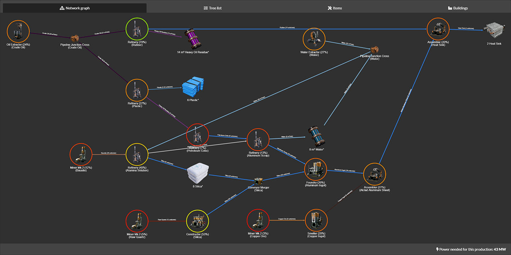

# Dyson-Calculator Production Planner aka "DSPCPP"

<!-- ABOUT THE PROJECT -->
## About The Project

The production planner is able to produce factory chains for Dyson Sphere Program.
A game from Youthcat Studio.

[](https://dyson-calculator.com/en/production-planner)

This repository is the planner as a standalone [Next.js](https://nextjs.org) app
that deploys to Vercel as-is. Upstream it was only the calculation bundle:
`webpack` built a single script that dyson-calculator.com loaded into a page it
rendered itself, so there was nothing here to deploy — no HTML, no entry point,
and the markup that script drove lived in that site. The app in `app/` supplies
that missing half, and the embed bundle is gone: this repo builds one thing.

## Deploying to Vercel

1. Import the repository on Vercel. The Next.js preset is detected — no build
   settings to change.
2. Set `GAME_DATA_URL` (see below) so the planner runs on the real game data.
3. Deploy.

Nothing else is required: there is no database, no server state, and the whole
calculation runs in the visitor's browser.

## Game data

The planner needs a buildings / items / recipes table. `app/api/game/route.js`
fetches it server-side and hands it to the page, which keeps the browser
same-origin and lets the response be cached at the edge for an hour.

| Variable | Default | Meaning |
| --- | --- | --- |
| `GAME_DATA_URL` | `https://dyson-calculator.com/{lang}/api/game` | Endpoint returning `{buildingsData, itemsData, recipesData}`. `{lang}` is replaced with the requested language. |

If that endpoint cannot be reached, the route falls back to the small sample
dataset in `lib/sampleGameData.js` and the page says so in a banner. The sample
data is deliberately synthetic — it mirrors `test/fixtures/gameData.js` — so a
fresh deployment is clickable before `GAME_DATA_URL` is pointed anywhere.

Point `GAME_DATA_URL` only at an origin you trust: `src/Worker.js` interpolates
item names and URLs straight into the HTML it generates, exactly as it did
upstream, so a hostile game-data feed could inject markup into the results
panels.

## Running locally

```
npm install
npm run dev          # http://localhost:3000
npm run build        # production build
npm start            # serve the production build
```

## How it fits together

| Path | What it is |
| --- | --- |
| `src/Worker.js` | The planner itself, untouched. It is one self-contained function so it can be stringified into a Blob and run as a real WebWorker. |
| `lib/plannerWorker.js` | Starts that worker and relays its messages. |
| `lib/plannerState.js` | The planner's inputs, and their two shapes: the `formData` the worker expects, and the `/json/<payload>` share URL. |
| `components/Planner.jsx` | The page: item pickers, options, tabs, loader — the half that used to live in the upstream site's templates. |
| `components/ProductionGraph.jsx` | The factory layout, cytoscape + ELK, with the stylesheet the upstream page used. |
| `app/api/game/route.js` | Game-data proxy, with the sample-data fallback. |

Share URLs keep the upstream `/json/<url-encoded JSON>` shape, so links made by
the original planner open here unchanged.

## Tests

`npm test` runs the differential and unit suites over `src/Worker.js` — see
[test/README.md](test/README.md). The calculation is untouched by this
conversion, and those tests are what pins it that way.

<!-- ROADMAP -->
## Roadmap

See the [open issues](https://github.com/AnthorNet/DSP-ProductionPlanner/issues) for a list of proposed features (and known issues).
